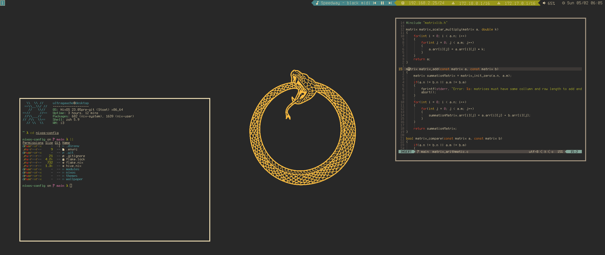

# ❄️ My NixOs Configuration

**My daily driver NixOs configuration, subject to constant tweaks :)**

## Programs

| Type           | Program      |
| :------------- | :----------: |
| Editor         | [NeoVim](https://neovim.io/) |
| Launcher       | [Rofi](https://github.com/davatorium/rofi) |
| Screenshots    | [Flameshot](https://flameshot.org/) | 
| Shell          | [Zsh](https://www.zsh.org/) |
| Status Bar     | [i3status-rust](https://github.com/greshake/i3status-rust) |
| Terminal       | [Alacritty](https://github.com/alacritty/alacritty) |
| Window Manager | [i3wm](https://i3wm.org/) |

## Theme
My configuration uses the [Gruvbox theme](https://github.com/morhetz/gruvbox) for most interfaces